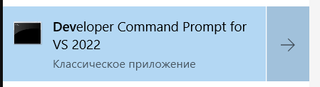

Для запуска нужно:
- Скачать [Rustup](https://www.rust-lang.org/tools/install)
- Переключится на `nightly`
  - `> rustup default nightly`
  - Возможно `> rustup update`
- Можно запускать
    - или `> cargo run --manifest-path back/Cargo.toml`
    - или `Task Run в VsCode`
- DieselTool(Для миграций)
    - Добавить PATH если нет: `~/.cargo/bin`
    - `> cargo install diesel_cli --no-default-features --features sqlite`
    - Если что-то пошло не так, а на Windows это почти всегда:
        - Установить `sqlite` (наверно есть установщик)
        - sqlite.dll может где-те лежать (python,.NET,или [тут](https://www.sqlite.org/download.html))
        - sqlite.lib на винду почему то не приходит cам так что запускаем это в папке с `sqlite.def` и `sqlite.dll`: 
        
        `> link /lib /def:sqlite3.def /MACHINE:X64`
        - Нужные переменные среды:
            - PATH: путь до sqlite.dll
            - SQLITE3_LIB_DIR: путь до sqlite.lib
- Миграции
    - `back> diesel migration run --all`

> В теории теперь у тебя есть бдшка и бэк запускается
